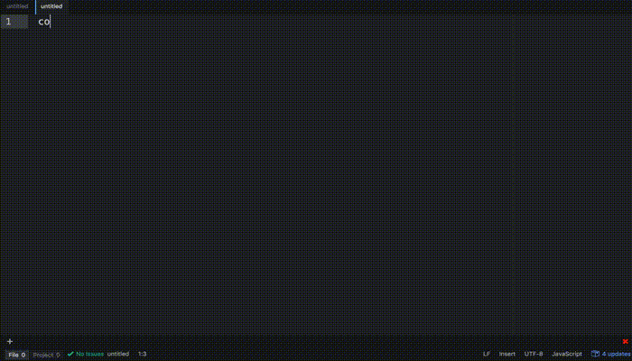

# CodeFitness

Discover features of your favorite language by unlocking achievements



## Installing

Make sure you have Atom installed along with the command line tools, and run:

```
git clone https://github.com/nicktikhonov/codefitness
cd codefitness
npm install
apm link
```
